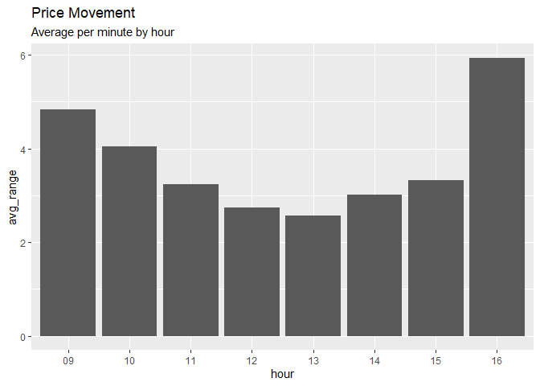
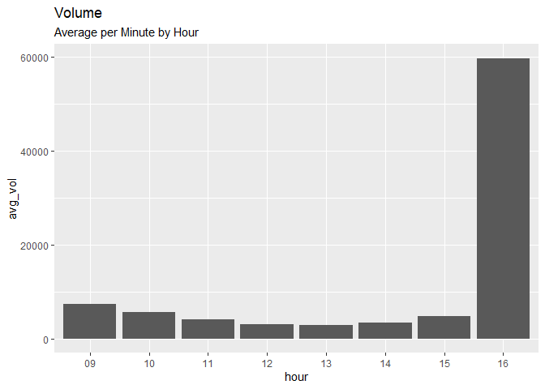
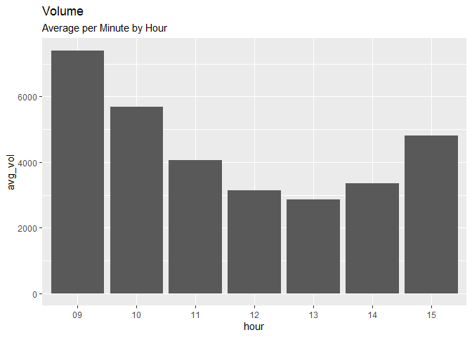
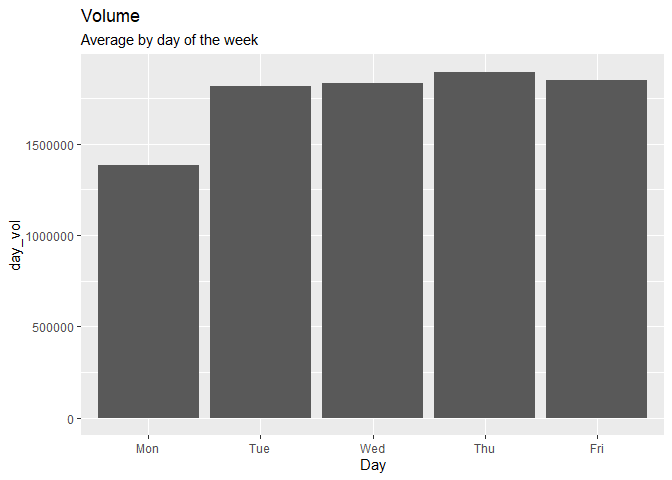

E-mini S&P 500 Analysis
================
Fady Koutieche Aziz
2023-02-17

The Standard and Poor’s 500, or simply the S&P 500, is a stock market
index tracking the stock performance of 500 large companies listed on
stock exchanges in the United States. It is one of the most commonly
followed equity indices. As of December 31, 2020, more than \$5.4
trillion was invested in assets tied to the performance of the index.

## Loading packages and libraries

``` r
library(tidyverse)
library(lubridate)
library(dplyr)
```

## Loading the data

``` r
es_0802 <- read.csv("C:/Users/FKOUT/Documents/CODE/es_0802.csv")
```

## Cleaning and Formatting

``` r
es_0802$Date <- mdy(es_0802$Date)
es_0802$Time <- hms::as_hms(es_0802$Time)
col_remove <- c("Volume.up.down.Up.volume", 
                "Volume.up.down.Down.volume",
                "X")
es_0802 <- es_0802 %>% 
  select(- one_of(col_remove))
```

First we will create a dataframe filtering only data of the American
Session

We create this dataframe filtering data only from the American Session
to have a clear picture of the price action, volume and other aspects of
the market in the hours where most of the trading will take place

``` r
nine30open <- es_0802 %>% 
  filter(Date < '2022-11-05')

american <- nine30open %>% 
  filter(Time >= hms::as_hms("09:30:00"),
         Time <= hms::as_hms("16:00:00"))
```

Now we’ve got “american” which contains data from the american session
and also “nine30open” that contains data from the whole day

# Stats per minute:

### Volume

#### Average volume per minute on the American Session

``` r
mean(american$Volume)
```

    ## [1] 4390.387

### Price Movement (Range)

#### Average price movement per minute

``` r
american$range <- american$High - american$Low
mean(american$range)
```

    ## [1] 3.297115

Now we will create a dataframe that gets hour from the Hour column to do
some Hourly analysis

``` r
american_hourly <- american
american_hourly$hour <- strftime(
  american_hourly$Time, '%H')
```

# Stats per Hour

## Price Movement (Range)

Average range per minute on each trading hour

``` r
hour_range <- american_hourly %>% 
  group_by(hour) %>% 
  summarize(avg_range=mean(range))

ggplot(hour_range, aes(x=hour, y=avg_range))+
  geom_bar(stat='identity')+
  labs(title = "Price Movement",
       subtitle = "Average per minute by hour")
```

<!-- -->

## Volume

#### Average volume per minute by hour

``` r
hour_vol <- american_hourly %>% 
  group_by(hour) %>% 
  summarize(avg_vol=mean(Volume))

ggplot(hour_vol, aes(x=hour, y=avg_vol))+
  geom_bar(stat='identity')+
  labs(title = "Volume",
       subtitle = "Average per Minute by Hour")
```

<!-- --> Since most
daytraders will be active during the first 2-3 hours let’s create a
dataframe excluding the volume from 4:00 PM, which is exponentially
higher compared to other hours.

``` r
trd_hours_vol <- hour_vol %>% 
  filter(! hour_vol$hour %in% '16')
```

This chart will give us a better idea of how the volume evolves during
the first few hours from the market open

``` r
ggplot(trd_hours_vol, aes(x=hour, y=avg_vol))+
  geom_bar(stat='identity')+
  labs(title = "Volume",
       subtitle= "Average per Minute by Hour")
```

<!-- --> It is very
clear that the most amount of trades occur within the first 2-3 hours,
reaching it’s lowest levels during 12 and 1 PM.

# Stats per Day

Let’s first create a dataframe that will let us do some analysis by day
of the week We will start by extracting the Day name from the Date
column:

``` r
daily_main <- es_0802
daily_main$Day <- strftime(daily_main$Date, '%a')
```

Then, let’s summarize Volume and define High of Day, Low of Day and make
the operation to determine the range of the day

``` r
daily_sum <- daily_main %>%
  group_by(Date) %>% 
  summarize(day_vol=sum(Volume),
            HOD=max(High),
            LOD=min(Low))
daily_sum$day_range <- daily_sum$HOD - daily_sum$LOD
```

## Average range of price in a day

``` r
mean(daily_sum$day_range)
```

    ## [1] 71.40359

On the E-Mini S&P 500 the price has moved on average 71 points per day
in the last 5 months.

## Average volume in a day

``` r
mean(daily_sum$day_vol)
```

    ## [1] 1490278

A total of 1,490,278 contracts have been traded on average for the last
5 months.

# Weekly Stats by Day

Now we will analyze variables such as Volume, Range by day of the week
and arrange the order by the days of the week

``` r
daily_sum$Day <- strftime(daily_sum$Date, '%a')

week_stats <- daily_sum %>%
  group_by(Day) %>% 
  summarize(day_vol=mean(day_vol),
            day_range=mean(day_range))

week_stats <- week_stats %>% 
  filter(! week_stats$Day %in% 'Sun')

week_stats$Day <- factor(week_stats$Day, levels = c(
  "Mon", "Tue", "Wed", "Thu", "Fri"))
```

## Volume

#### Average by day of the week

``` r
ggplot(week_stats, aes(x=Day, y=day_vol))+
  geom_bar(stat='identity')+
  labs(title= "Volume",
       subtitle= "Average by day of the week")
```

<!-- -->
